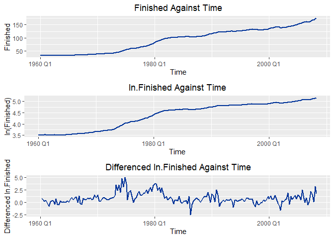
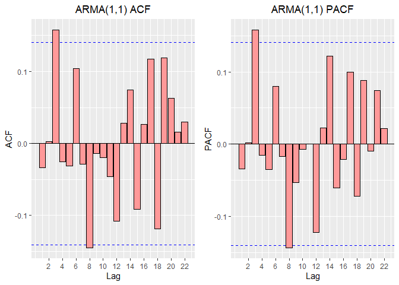
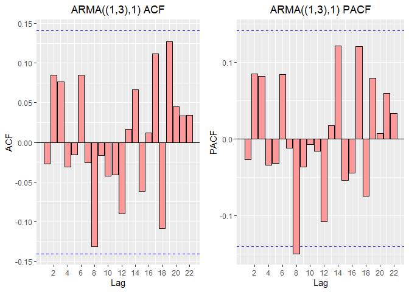
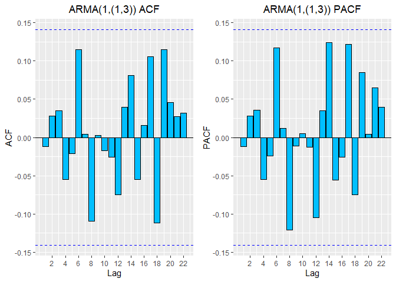
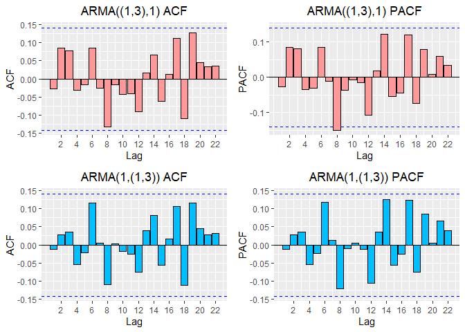
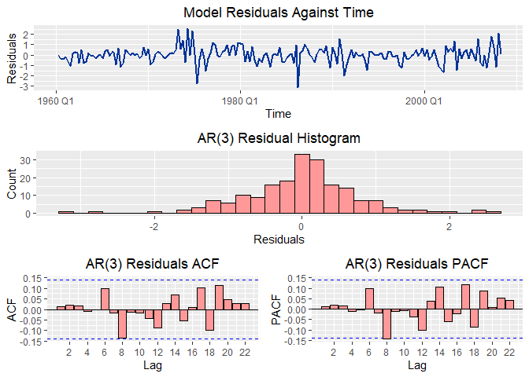
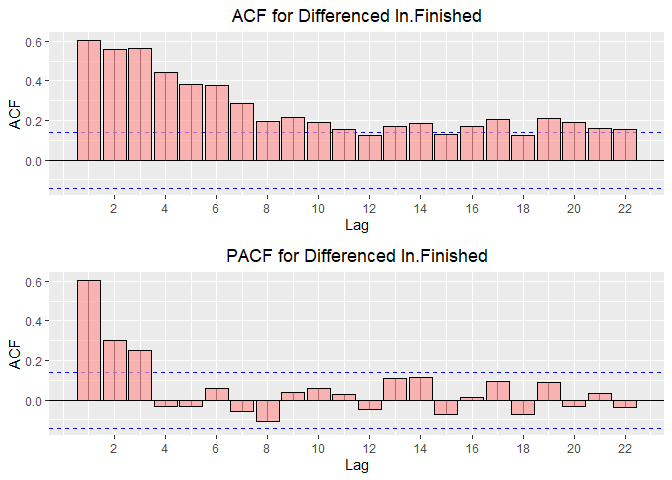
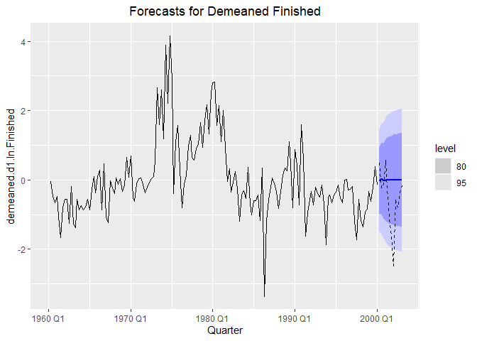
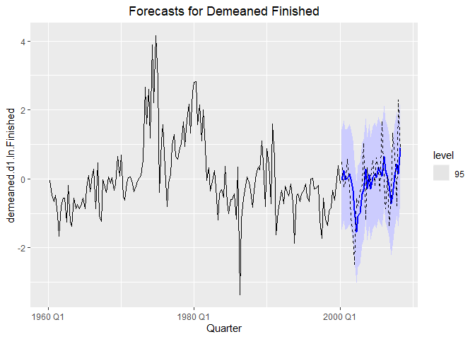

PPI\_Finished\_Goods\_Forecast
================
William Brasic
4/3/2021

### Clear Environment and Console

``` r
rm(list=ls())
cat("\014")
```

&#12;

### Set Working Directory

``` r
setwd("C:/Users/wbras/OneDrive/Desktop/GitHub/Time_Series_PPI_Finished_R")
```

### Install and Load Necessary Packages

``` r
if (!require(tidyverse)) install.packages('tidyverse')
if (!require(tsibble)) install.packages('tsibble')
if (!require(gridExtra)) install.packages('gridExtra')
if (!require(feasts)) install.packages('feasts')
if (!require(fable)) install.packages('fable')
if (!require(fabletools)) install.packages('fabletools')
if (!require(tseries)) install.packages('tseries')
if (!require(pacman)) install.packages('pacman')
if (!require(forecast)) install.packages('forecast')

pacman::p_load(tidyverse, tsibble)
```

## Data Preliminaries

``` r
## Load Dataset only for Finished ##
df <- read_csv('QUARTERLY.CSV')[,c('Date', 'Finished')]


## Converting Data to Time Series Dataframe; logging Finished; Differencing ln.Finished to Make it Stationary ##
df <- df %>%
  mutate(Quarter = yearquarter(Date)) %>%
  as_tsibble(index = Quarter) %>%
  relocate(Quarter) %>%
  select(-Date) %>%
  mutate(ln.Finished = log(Finished)) %>%
  mutate(d1.ln.Finished = 100*difference(ln.Finished,1))
```

## Visualizing Variations of Data Over Time

``` r
## Plot Finished Over Time ##
plot.Finished.time <- df %>%
  ggplot() + 
  geom_line(aes(x = Quarter, y = Finished), color = '#003399', size = 1) + 
  ggtitle('Finished Against Time') + 
  theme(plot.title = element_text(hjust = 0.5)) +
  xlab('Time') + 
  ylab('Finished')


## Plot ln.Finished Over Time ##
plot.ln.Finished.time <- df %>%
  ggplot() + 
  geom_line(aes(x = Quarter, y = ln.Finished), color = '#003399', size = 1) + 
  ggtitle('ln.Finished Against Time') + 
  theme(plot.title = element_text(hjust = 0.5)) +
  xlab('Time') + 
  ylab('ln(Finished)')


## Plot d1.ln.Finished Over Time ##
plot.d1.ln.Finished.time <- df %>%
  ggplot() + 
  geom_line(aes(x = Quarter, y = d1.ln.Finished), color = '#003399', size = 1) + 
  ggtitle('Differenced ln.Finished Against Time') + 
  theme(plot.title = element_text(hjust = 0.5)) +
  xlab('Time') + 
  ylab('Differenced ln.Finished')


## Putting Three Above Plots Into One Picture ##
gridExtra::grid.arrange(plot.Finished.time, 
                        plot.ln.Finished.time, 
                        plot.d1.ln.Finished.time,
                        ncol=1) 
```

<!-- -->

### Load Necessary Packages for Subsequent Code

``` r
pacman::p_load(fable, fabletools, feasts)
# fable is for ARIMA, fabletools is for report, feasts is for ACF
```

## ARMA(1,1)

``` r
## ARMA(1,1) w/ Intercept ##
arma11 <- df[, c('Quarter', 'd1.ln.Finished')] %>%
  model(ARIMA(d1.ln.Finished ~ 1 + pdq(1,0,1) + PDQ(0,0,0)))
report(arma11)
```

    ## Series: d1.ln.Finished 
    ## Model: ARIMA(1,0,1) w/ mean 
    ## 
    ## Coefficients:
    ##          ar1      ma1  constant
    ##       0.9041  -0.5209    0.0851
    ## s.e.  0.0390   0.0733    0.0263
    ## 
    ## sigma^2 estimated as 0.6363:  log likelihood=-229.59
    ## AIC=467.18   AICc=467.39   BIC=480.25

``` r
coef(arma11)
```

    ## # A tibble: 3 x 6
    ##   .model                            term   estimate std.error statistic  p.value
    ##   <chr>                             <chr>     <dbl>     <dbl>     <dbl>    <dbl>
    ## 1 ARIMA(d1.ln.Finished ~ 1 + pdq(1~ ar1      0.904     0.0390     23.2  1.01e-57
    ## 2 ARIMA(d1.ln.Finished ~ 1 + pdq(1~ ma1     -0.521     0.0733     -7.11 2.22e-11
    ## 3 ARIMA(d1.ln.Finished ~ 1 + pdq(1~ const~   0.0851    0.0263      3.24 1.40e- 3

``` r
## Empirical ACF for ARMA(1,1) Residuals ##
arma11.residuals.acf <- residuals(arma11) %>%
  ACF(.resid) %>%
  autoplot() +
  geom_bar(stat = 'identity', 
           fill = "#FF9999",
           color = 'black') +
  ggtitle('ARMA(1,1) ACF') + 
  theme(plot.title = element_text(hjust = 0.5)) +
  xlab('Lag') + 
  ylab('ACF')
  
  
## Empirical PACF for ARMA(1,1) Residuals ##
arma11.residuals.pacf <- residuals(arma11) %>%
  ACF(.resid, type = 'partial') %>%
  autoplot() +
  geom_bar(stat = 'identity', 
           fill = "#FF9999",
           color = 'black') +
  ggtitle('ARMA(1,1) PACF') + 
  theme(plot.title = element_text(hjust = 0.5)) +
  xlab('Lag') + 
  ylab('PACF')
  
  
## EACF and EPACF Together ##
gridExtra::grid.arrange(arma11.residuals.acf, 
                        arma11.residuals.pacf, 
                        nrow=1)
```

<!-- -->

``` r
## Note that we have significant residual correlation which is an issue ##


## Residual Correlation Test @ lag=3 ##
residuals(arma11) %>% 
  features(.resid, feasts::ljung_box, lag = 3, dof = 2)
```

    ## # A tibble: 1 x 3
    ##   .model                                                  lb_stat lb_pvalue
    ##   <chr>                                                     <dbl>     <dbl>
    ## 1 ARIMA(d1.ln.Finished ~ 1 + pdq(1, 0, 1) + PDQ(0, 0, 0))    5.13    0.0235

``` r
## We would reject the null of zero residual serial correlation ##
## ARMA(1,1) should be eliminated from consideration ##
```

## Restricted ARMA((1,3),1)

``` r
## ARMA((1,3),1) Model ##
arma.r.21 <- df[, c('Quarter', 'd1.ln.Finished')] %>%
  model(ARIMA(d1.ln.Finished ~ 1 + pdq(3,0,1) + PDQ(0,0,0), 
              fixed=list(ar1=NA, ar2=0, ar3=NA, ma1=NA, constant=NA)))
report(arma.r.21)
```

    ## Series: d1.ln.Finished 
    ## Model: ARIMA(3,0,1) w/ mean 
    ## 
    ## Coefficients:
    ##          ar1  ar2     ar3      ma1  constant
    ##       0.6732    0  0.1828  -0.2928    0.1277
    ## s.e.  0.1593    0  0.1195   0.1661    0.0386
    ## 
    ## sigma^2 estimated as 0.6334:  log likelihood=-228.67
    ## AIC=467.34   AICc=467.66   BIC=483.68

``` r
coef(arma.r.21)
```

    ## # A tibble: 5 x 6
    ##   .model                           term   estimate std.error statistic   p.value
    ##   <chr>                            <chr>     <dbl>     <dbl>     <dbl>     <dbl>
    ## 1 "ARIMA(d1.ln.Finished ~ 1 + pdq~ ar1       0.673    0.159       4.23   3.66e-5
    ## 2 "ARIMA(d1.ln.Finished ~ 1 + pdq~ ar2       0        0         NaN    NaN      
    ## 3 "ARIMA(d1.ln.Finished ~ 1 + pdq~ ar3       0.183    0.119       1.53   1.28e-1
    ## 4 "ARIMA(d1.ln.Finished ~ 1 + pdq~ ma1      -0.293    0.166      -1.76   7.95e-2
    ## 5 "ARIMA(d1.ln.Finished ~ 1 + pdq~ const~    0.128    0.0386      3.31   1.13e-3

``` r
## Empirical ACF for ARMA((1,3),1) Residuals ##
arma.r.21.residuals.acf <- residuals(arma.r.21) %>%
  ACF(.resid) %>%
  autoplot() +
  geom_bar(stat = 'identity', 
           fill = "#FF9999",
           color = 'black') +
  ggtitle('ARMA((1,3),1) ACF') + 
  theme(plot.title = element_text(hjust = 0.5)) +
  xlab('Lag') + 
  ylab('ACF')


## Empirical PACF for ARMA((1,3),1) Residuals ##
arma.r.21.residuals.pacf <- residuals(arma.r.21) %>%
  ACF(.resid, type = 'partial') %>%
  autoplot() +
  geom_bar(stat = 'identity', 
           fill = "#FF9999",
           color = 'black') +
  ggtitle('ARMA((1,3),1) PACF') + 
  theme(plot.title = element_text(hjust = 0.5)) +
  xlab('Lag') + 
  ylab('PACF')


## EACF and EPACF Together ##
arma.r.21.residuals.acf.pacf <- gridExtra::grid.arrange(arma.r.21.residuals.acf, 
                                                        arma.r.21.residuals.pacf, 
                                                        nrow=1)
```

<!-- -->

``` r
## Residual Correlation Test @ lag=8 for ARMA((1,3),1) ##
residuals(arma.r.21) %>% 
  features(.resid, feasts::ljung_box, lag = 8, dof = 2)
```

    ## # A tibble: 1 x 3
    ##   .model                                                       lb_stat lb_pvalue
    ##   <chr>                                                          <dbl>     <dbl>
    ## 1 "ARIMA(d1.ln.Finished ~ 1 + pdq(3, 0, 1) + PDQ(0, 0, 0), fi~    8.09     0.232

``` r
## Test above confirms that the residual autocorrelation at lag = 8 is an Issue ##
```

## Restricted ARMA(1,(1,3))

``` r
## ARMA(1,(1,3)) Model ##
arma.r.12 <- df[, c('Quarter', 'd1.ln.Finished')] %>%
  model(ARIMA(d1.ln.Finished ~ 1 + pdq(1,0,3) + PDQ(0,0,0), 
              fixed=list(ar1=NA, ma1=NA, ma2=0, ma3=NA, constant=NA)))
report(arma.r.12)
```

    ## Series: d1.ln.Finished 
    ## Model: ARIMA(1,0,3) w/ mean 
    ## 
    ## Coefficients:
    ##          ar1      ma1  ma2     ma3  constant
    ##       0.8543  -0.4958    0  0.1498    0.1298
    ## s.e.  0.0566   0.0857    0  0.0697    0.0359
    ## 
    ## sigma^2 estimated as 0.6257:  log likelihood=-227.52
    ## AIC=465.04   AICc=465.36   BIC=481.38

``` r
coef(arma.r.12)
```

    ## # A tibble: 5 x 6
    ##   .model                          term   estimate std.error statistic    p.value
    ##   <chr>                           <chr>     <dbl>     <dbl>     <dbl>      <dbl>
    ## 1 "ARIMA(d1.ln.Finished ~ 1 + pd~ ar1       0.854    0.0566     15.1    1.59e-34
    ## 2 "ARIMA(d1.ln.Finished ~ 1 + pd~ ma1      -0.496    0.0857     -5.78   2.90e- 8
    ## 3 "ARIMA(d1.ln.Finished ~ 1 + pd~ ma2       0        0         NaN    NaN       
    ## 4 "ARIMA(d1.ln.Finished ~ 1 + pd~ ma3       0.150    0.0697      2.15   3.29e- 2
    ## 5 "ARIMA(d1.ln.Finished ~ 1 + pd~ const~    0.130    0.0359      3.61   3.84e- 4

``` r
## Empirical ACF for ARMA(1,(1,3)) Residuals ##
arma.r.12.residuals.acf <- residuals(arma.r.12) %>%
  ACF(.resid) %>%
  autoplot() +
  geom_bar(stat = 'identity', 
           fill = "deepskyblue",
           color = 'black') +
  ggtitle('ARMA(1,(1,3)) ACF') + 
  theme(plot.title = element_text(hjust = 0.5)) +
  xlab('Lag') + 
  ylab('ACF')


## Empirical PACF for ARMA(1,(1,3)) Residuals ##
arma.r.12.residuals.pacf <- residuals(arma.r.12) %>%
  ACF(.resid, type = 'partial') %>%
  autoplot() +
  geom_bar(stat = 'identity', 
           fill = "deepskyblue",
           color = 'black') +
  ggtitle('ARMA(1,(1,3)) PACF') + 
  theme(plot.title = element_text(hjust = 0.5)) +
  xlab('Lag') + 
  ylab('PACF')


## EACF and EPACF Together ##
arma.r.12.residuals.acf.pacf <- gridExtra::grid.arrange(arma.r.12.residuals.acf,
                                                        arma.r.12.residuals.pacf, 
                                                        nrow=1)
```

<!-- -->

``` r
## Residual Correlation Test @ lag=8 for ARMA(1,(1,3)) ##
residuals(arma.r.12) %>% 
  features(.resid, feasts::ljung_box, lag = 8, dof = 2)
```

    ## # A tibble: 1 x 3
    ##   .model                                                       lb_stat lb_pvalue
    ##   <chr>                                                          <dbl>     <dbl>
    ## 1 "ARIMA(d1.ln.Finished ~ 1 + pdq(1, 0, 3) + PDQ(0, 0, 0), fi~    6.19     0.402

## Empirical Residual Evaluation of Both ARMA Models Together

``` r
## ACF and PACF for both Restricted ARMA Models ##
gridExtra::grid.arrange(arma.r.21.residuals.acf.pacf,
                        arma.r.12.residuals.acf.pacf,
                        nrow=2)
```

<!-- -->

``` r
## Hence, the latter model fits the data better ##
```

## AR(3)

``` r
## AR(3) w/ Intercept ##
ar3 <- df[, c('Quarter', 'd1.ln.Finished')] %>%
  model(ARIMA(d1.ln.Finished ~ 1 + pdq(3,0,0) + PDQ(0,0,0)))
report(ar3)
```

    ## Series: d1.ln.Finished 
    ## Model: ARIMA(3,0,0) w/ mean 
    ## 
    ## Coefficients:
    ##          ar1     ar2     ar3  constant
    ##       0.3396  0.2025  0.2529    0.1825
    ## s.e.  0.0694  0.0738  0.0713    0.0543
    ## 
    ## sigma^2 estimated as 0.6218:  log likelihood=-226.92
    ## AIC=463.84   AICc=464.16   BIC=480.18

``` r
coef(ar3)
```

    ## # A tibble: 4 x 6
    ##   .model                           term    estimate std.error statistic  p.value
    ##   <chr>                            <chr>      <dbl>     <dbl>     <dbl>    <dbl>
    ## 1 ARIMA(d1.ln.Finished ~ 1 + pdq(~ ar1        0.340    0.0694      4.89  2.09e-6
    ## 2 ARIMA(d1.ln.Finished ~ 1 + pdq(~ ar2        0.202    0.0738      2.75  6.62e-3
    ## 3 ARIMA(d1.ln.Finished ~ 1 + pdq(~ ar3        0.253    0.0713      3.55  4.89e-4
    ## 4 ARIMA(d1.ln.Finished ~ 1 + pdq(~ consta~    0.182    0.0543      3.36  9.43e-4

``` r
## Function For Visualizing Model Residuals ##
model.residual.plotter <- function(model, 
                                   time.column.title,
                                   hist.title = 'Histogram',
                                   acf.title = 'ACF', 
                                   pacf.title = 'PACF',
                                   fill = "#FF9999"){
  
  ## Histogram of Residuals ##
  model.hist.residuals <- residuals({{model}}) %>%
    ggplot(aes(x = .resid)) + 
    geom_histogram(binwidth=0.2, color="black", fill= {{fill}}) + 
    ggtitle({{hist.title}}) + 
    theme(plot.title = element_text(hjust = 0.5)) +
    xlab('Residuals') + 
    ylab('Count')
  
  
  ## Residuals Over Time ##
  model.residuals.time <- residuals({{model}}) %>%
    ggplot() + 
    geom_line(aes(x = {{time.column.title}}, 
                  y = .resid), color = '#003399', size = 1) + 
    ggtitle('Model Residuals Against Time') + 
    theme(plot.title = element_text(hjust = 0.5)) +
    xlab('Time') + 
    ylab('Residuals')
  
  
  ## Empirical ACF for Model Residuals ##
  model.residuals.acf <- residuals({{model}}) %>%
    feasts::ACF(.resid) %>%
    autoplot() +
    geom_bar(stat = 'identity', 
             fill = {{fill}},
             color = 'black') +
    ggtitle({{acf.title}}) + 
    theme(plot.title = element_text(hjust = 0.5)) +
    xlab('Lag') + 
    ylab('ACF')
  
  
  ## Empirical PACF for Model Residuals ##
  model.residuals.pacf <- residuals({{model}}) %>%
    feasts::ACF(.resid, type = 'partial') %>%
    autoplot() +
    geom_bar(stat = 'identity', 
             fill = {{fill}},
             color = 'black') +
    ggtitle({{pacf.title}}) + 
    theme(plot.title = element_text(hjust = 0.5)) +
    xlab('Lag') + 
    ylab('PACF')
  
  
  ## Various Residual Plots Together ##
  all.plots <- gridExtra::grid.arrange(model.residuals.time, 
                                       model.hist.residuals,
                                       gridExtra::grid.arrange(model.residuals.acf,
                                                               model.residuals.pacf,
                                                               nrow=1), 
                                       nrow=3) 
  
  return(all.plots)
  
}


## Using Above Function To Visualize Residuals ##
model.residual.plotter(model = ar3, 
                       hist.title = 'AR(3) Residual Histogram',
                       time.column.title = Quarter, 
                       acf.title = 'AR(3) Residuals ACF',
                       pacf.title = 'AR(3) Residuals PACF')
```

<!-- -->

    ## TableGrob (3 x 1) "arrange": 3 grobs
    ##   z     cells    name            grob
    ## 1 1 (1-1,1-1) arrange  gtable[layout]
    ## 2 2 (2-2,1-1) arrange  gtable[layout]
    ## 3 3 (3-3,1-1) arrange gtable[arrange]

``` r
## Residual Correlation Test @ lag=8 for AR(3) ##
residuals(ar3) %>% 
  features(.resid, feasts::ljung_box, lag = 8, dof = 2)
```

    ## # A tibble: 1 x 3
    ##   .model                                                  lb_stat lb_pvalue
    ##   <chr>                                                     <dbl>     <dbl>
    ## 1 ARIMA(d1.ln.Finished ~ 1 + pdq(3, 0, 0) + PDQ(0, 0, 0))    6.04     0.419

``` r
## Test above confirms that the the slight residual autocorrelation @ lag = 8 is NO issue ##
```

## ACF and PACF for Outcome Variable

``` r
## Function for Visualizing ACF and PACF ##
acf.pacf.plotter <- function(dataframe, variable, title.acf, title.pacf,
                             fill = '#FF9999') {
  
  plot.acf <- {{dataframe}} %>%
    feasts::ACF({{variable}}) %>%
    autoplot() +
    geom_bar(stat = 'identity', 
             fill = {{fill}},
             color = 'black',
             alpha = 0.7) +
    ggtitle({{title.acf}}) + 
    theme(plot.title = element_text(hjust = 0.5)) +
    xlab('Lag') + 
    ylab('ACF')
  
  plot.pacf <- {{dataframe}} %>%
    feasts::ACF({{variable}}, type = 'partial')%>%
    autoplot() +
    geom_bar(stat = 'identity', 
             fill = {{fill}},
             color = 'black',
             alpha = 0.7) +
    ggtitle({{title.pacf}}) + 
    theme(plot.title = element_text(hjust = 0.5)) +
    xlab('Lag') + 
    ylab('ACF')
  
  plot.acf.pacf <- gridExtra::grid.arrange(plot.acf, plot.pacf, nrow=2)
  
  return(plot.acf.pacf)
  
}

## Using Above Function to Plot Residuals ##
acf.pacf.plotter(dataframe = df, 
                 variable = d1.ln.Finished, 
                 title.acf = 'ACF for Differenced ln.Finished',
                 title.pacf = 'PACF for Differenced ln.Finished')
```

<!-- -->

    ## TableGrob (2 x 1) "arrange": 2 grobs
    ##   z     cells    name           grob
    ## 1 1 (1-1,1-1) arrange gtable[layout]
    ## 2 2 (2-2,1-1) arrange gtable[layout]

## Demeaning Outcome Variable

#### After Doing this We No Longer Need to Include an Intercept

``` r
## Demeaning d1.ln.Finished ##
df$demeaned.d1.ln.Finished <- df$d1.ln.Finished - mean(df$d1.ln.Finished, 
                                                       na.rm = T)


## Verify Above Code ##
head(df$demeaned.d1.ln.Finished)
```

    ## [1]          NA -0.05069385 -0.47517927 -0.65563577 -0.47750092 -1.04338109

``` r
head(df$d1.ln.Finished)
```

    ## [1]         NA  0.8141158  0.3896303  0.2091738  0.3873087 -0.1785715

``` r
mean(df$d1.ln.Finished, na.rm = T)
```

    ## [1] 0.8648096

## Create Training Dataframe

``` r
df.training <- df[1:which(as.character(df$Quarter) == '2000 Q1'),]
```

## AR(3) w/ Training Data and Confirm AR(3) is Best

``` r
## AR(3) For demeaned.d1.ln.Finished ##
demeaned.ar3 <- df.training[, c('Quarter', 'demeaned.d1.ln.Finished')] %>% 
  model(ARIMA(demeaned.d1.ln.Finished ~ pdq(3,0,0) + PDQ(0,0,0)))
coef(demeaned.ar3)
```

    ## # A tibble: 3 x 6
    ##   .model                             term  estimate std.error statistic  p.value
    ##   <chr>                              <chr>    <dbl>     <dbl>     <dbl>    <dbl>
    ## 1 ARIMA(demeaned.d1.ln.Finished ~ p~ ar1      0.387    0.0766      5.05  1.18e-6
    ## 2 ARIMA(demeaned.d1.ln.Finished ~ p~ ar2      0.206    0.0809      2.55  1.18e-2
    ## 3 ARIMA(demeaned.d1.ln.Finished ~ p~ ar3      0.226    0.0765      2.95  3.65e-3

``` r
## Confirming AR(3) Process is Optimal For Time Series ##
auto.demeaned <- df.training[, c('Quarter', 'demeaned.d1.ln.Finished')] %>%
  model(ARIMA(demeaned.d1.ln.Finished ~ PDQ(0,0,0), stepwise=FALSE, approximation=FALSE))
coef(auto.demeaned)
```

    ## # A tibble: 3 x 6
    ##   .model                             term  estimate std.error statistic  p.value
    ##   <chr>                              <chr>    <dbl>     <dbl>     <dbl>    <dbl>
    ## 1 "ARIMA(demeaned.d1.ln.Finished ~ ~ ar1      0.387    0.0766      5.05  1.18e-6
    ## 2 "ARIMA(demeaned.d1.ln.Finished ~ ~ ar2      0.206    0.0809      2.55  1.18e-2
    ## 3 "ARIMA(demeaned.d1.ln.Finished ~ ~ ar3      0.226    0.0765      2.95  3.65e-3

## Generate 12-step-ahead Forecast

``` r
## Generating h=12 Forecast Path ##
forecast.h12 <- demeaned.ar3 %>%
  forecast(h=12)


## Plotting h=12 Forecast Path with 80% and 95% CI ##
forecast.h12 %>%
  autoplot(data = df.training, level=c(80,95), size=1) +
  autolayer(filter_index(df, '2000 Q2' ~ '2003 Q1'), 
            .vars=demeaned.d1.ln.Finished, 
            color = "black", 
            linetype="dashed") +
  theme(plot.title = element_text(hjust = 0.5)) +
  labs(title = "Forecasts for Demeaned Finished") 
```

<!-- -->

## Incremental h=1 Forecast w/ Fixed Parameters

#### Here we are adding an additional observation to the training set before running the AR(3) while not allowing the parameters to be re-estimated each time the model is ran. This gives us 33 forecasts each of which are 1-step-ahead.

``` r
## Incremental h=1 Forecasts with Fixed Parameters ##
forecast.table <- NULL

for(i in c(0:32)){
  
  df.training.loop <- df[1:(which(as.character(df$Quarter) == '2000 Q1')+i), 
                           c('Quarter', 'demeaned.d1.ln.Finished')]
  
  model <- df.training.loop %>% 
    model(ARIMA(demeaned.d1.ln.Finished ~ pdq(3,0,0) + PDQ(0,0,0),
                fixed = list(ar1 = 0.387, ar2 = 0.206, ar3 = 0.226)))
  
  forecast <- model %>%
    forecast(h=1)
  
  forecast.table <- bind_rows(forecast.table, forecast)

}  
```

## Ploting Forecast Path w/ Actual PPI Finished Data

#### The actual data is represented by the dashed line

``` r
forecast.table %>%
  autoplot(data = df.training, level=95, size=1) +
  autolayer(filter_index(df, '2000 Q2' ~ '2008 Q2'), 
            .vars=demeaned.d1.ln.Finished, 
            color = "black", 
            linetype="dashed") +
  theme(plot.title = element_text(hjust = 0.5)) +
  labs(title = "Forecasts for Demeaned Finished") 
```

<!-- -->

## Incremental h=1 Forecast w/ Varying Parameters

#### Here we are adding an additional observation to the training set before running the AR(3) while allowing the parameters to be re-estimated each time the model is ran. This gives us 33 forecasts each of which are 1-step-ahead.

``` r
## Incremental h=1 Forecasts with Varying Parameters ##
forecast.table.1 <- NULL

for(i in c(0:32)){
  
  df.training.loop <- df[1:(which(as.character(df$Quarter) == '2000 Q1')+i), 
                         c('Quarter', 'demeaned.d1.ln.Finished')]
  
  model <- df.training.loop %>% 
    model(ARIMA(demeaned.d1.ln.Finished ~ pdq(3,0,0) + PDQ(0,0,0)))
  
  forecast <- model %>%
    forecast(h=1)
  
  forecast.table.1 <- bind_rows(forecast.table.1, forecast)
  
}  
```

## Ploting Forecast Path w/ actual PPI Finished Data

#### The actual data is represented by the dashed line

``` r
## Incremental h=1 Forecast Plot w/ 95% CI ##
forecast.table.1 %>%
  autoplot(data = df.training, level=95, size=1) +
  autolayer(filter_index(df, '2000 Q2' ~ '2008 Q2'), 
            .vars=demeaned.d1.ln.Finished, 
            color = "black", 
            linetype="dashed") +
  theme(plot.title = element_text(hjust = 0.5)) +
  labs(title = "Forecasts for Demeaned Finished") 
```

<!-- -->

## Testing for a Statistically Significant Difference Between Each Model’s Mean-Squared-Prediction-Error (MSpE)

``` r
e1 <- df$demeaned.d1.ln.Finished[which(as.character(df$Quarter) == '2000 Q2'):
                                         nrow(df)] - forecast.table$.mean
e2 <- df$demeaned.d1.ln.Finished[which(as.character(df$Quarter) == '2000 Q2'):
                                   nrow(df)] - forecast.table.1$.mean
forecast::dm.test(e1, e2)
```

    ## 
    ##  Diebold-Mariano Test
    ## 
    ## data:  e1e2
    ## DM = -0.57925, Forecast horizon = 1, Loss function power = 2, p-value =
    ## 0.5665
    ## alternative hypothesis: two.sided

``` r
## P-value on DM test statistic is 0.5508 ##
## Hence, fail to reject null ##
## Thus, models do NOT display a statistically significant difference in MSpE ##
```
